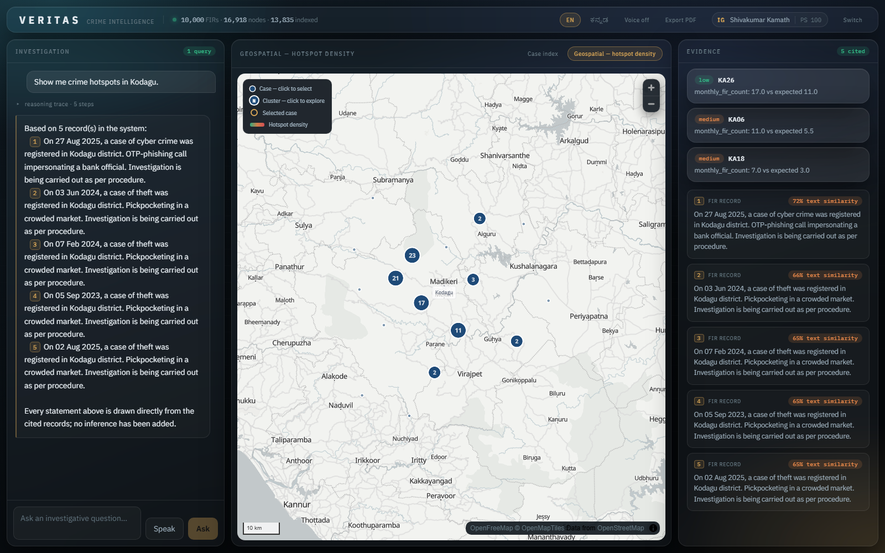
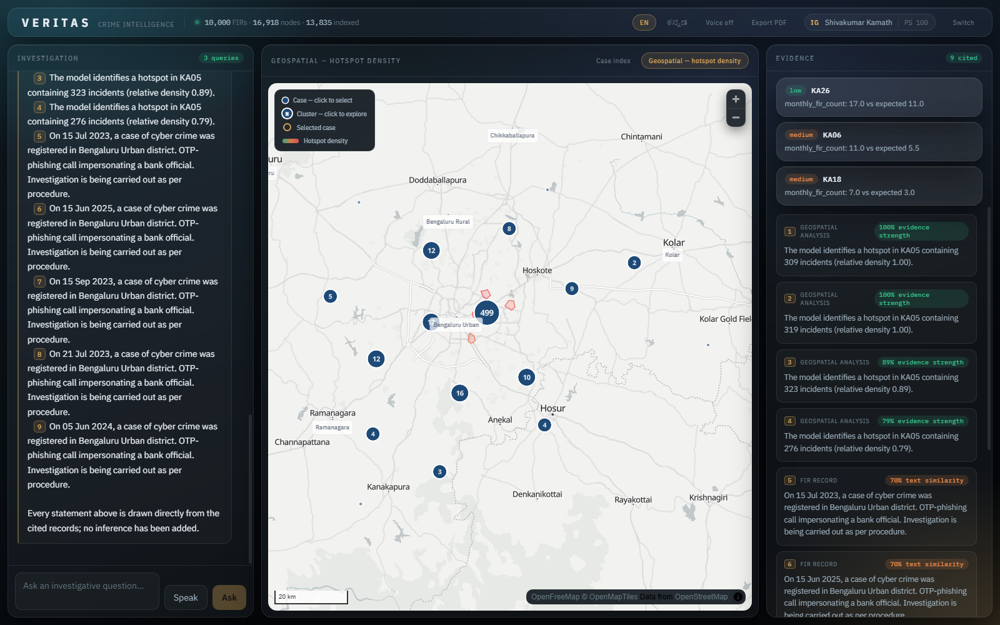
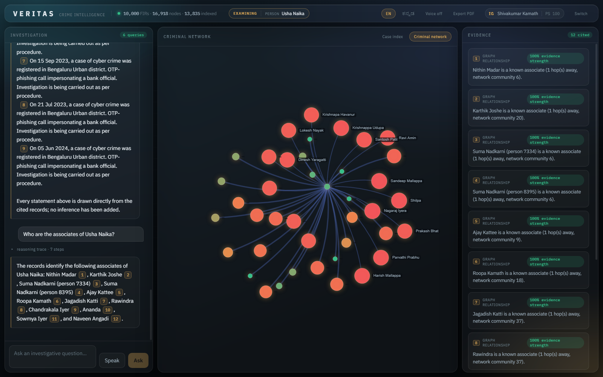
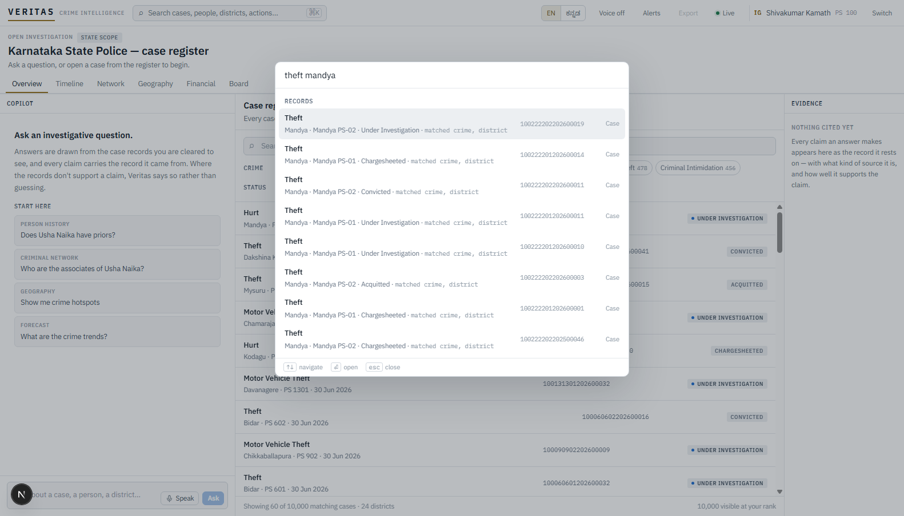
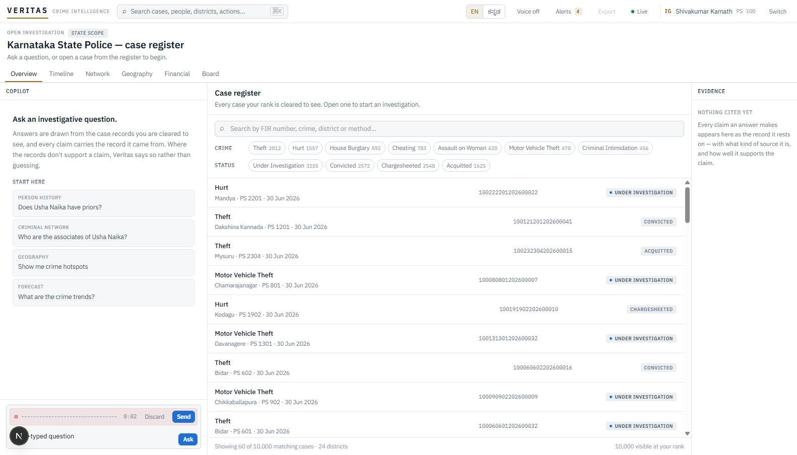
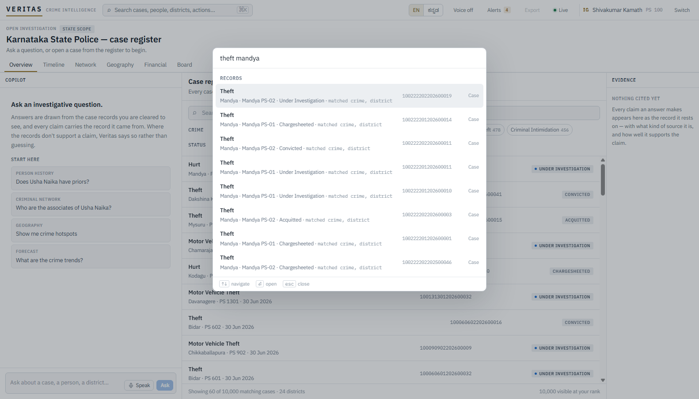

# Veritas

### A conversational crime-intelligence platform for the Karnataka State Police

An officer asks a question — typed or spoken, in English or Kannada — and gets an answer
where **every claim traces back to a specific police record**: each sentence carries a
citation chip that opens the exact FIR, person, account, or transaction it came from. When
the records don't support an answer, Veritas says exactly that instead of inventing one.

> **KSP Datathon 2026 · Challenge 01.** Built end-to-end and running live on Zoho Catalyst.
> Full design rationale for every decision lives in [CLAUDE.md](./CLAUDE.md) — this document
> is the front door.

| | |
|---|---|
| **Live API** | `https://veritas-api-50043864344.development.catalystappsail.in` |
| **Live console** | `https://veritas-60077763394.development.catalystserverless.in/app/index.html` |
| **Identity resolution** | **F1 0.989** (precision 0.997, recall 0.981) against the generator's answer key |
| **Test suite** | 868 passing, 2 skipped, no database or Docker required — `python -m pytest` |
| **Live footprint** | 10,000 FIRs · ~105k rows · graph of 16,918 nodes / 87,120 edges · 13,835 indexed documents |
| **Platform** | Zoho Catalyst — one AppSail container, Data Store, File Store, Cache, QuickML LLM, Cron |

---

## The problem

Every FIR, accused, account, and station transfer is recorded somewhere — and almost none of
it is connected. An officer wanting to know whether the person in front of them has a history
has to remember case numbers, know which colleague worked them, and read files by hand.
Officers also think and speak in Kannada while systems answer in English — and a
plausible-sounding wrong answer here is the difference between a lead and a wrongful
accusation. Veritas answers a plain question with a grounded, cited answer, or says "not
found in the available records" when that's the honest answer.

## The one fact that shaped everything

The organizers' ER (`Police_FIR_ER_Diagram.pdf`, reproduced verbatim) **has no concept of a
person** — `Accused.PersonID` is a per-case sort label ("A1", "A2"), not an identity. Read
literally, every offender is a first-timer, nobody co-offends, and "priors" has no answer. So
identity has to be **inferred** — Fellegi–Sunter probabilistic record linkage (1969)
reconstructs real people from `Accused` rows (F1 0.989), and everything downstream — networks,
financial layer, risk — depends on it existing. Why, and the pipeline ordering it forces:
[CLAUDE.md §0](./CLAUDE.md#0-the-two-constraints-that-shaped-everything).

---

## What an officer can ask

Every one of these runs today, against live data, with citations.

| Question | What Veritas does |
|---|---|
| *"Does Ramesh Gowda have prior cases?"* | Resolves his identity across cases the database never linked and answers with the specific case numbers — even across three spellings of his name. |
| *"How does he operate?"* | An evidence-backed behavioral profile — never demographic — built from a person's own case history: recurring time-of-day, a repeated method, geographic range, and escalation where the record's own gravity classification shows one, each line naming the FIRs it came from. |
| *"Is this part of a pattern?"* | Unprompted cross-station series discovery — the "linkage blindness" problem FBI ViCAP has named its own weakness since 1985 — a shared modus-operandi match to open cases at *different* stations with no common suspect on file. Surfaced proactively over the alert feed, not just on request. |
| *"Show me crime hotspots in Kolar."* | A KDE heat map from real incident coordinates with DBSCAN cluster cores, on a real MapLibre basemap (OpenFreeMap) — only a viewport tile z/x/y ever crosses the network. |
| *"Who does he operate with?"* | A co-offending network with community detection, labelled honestly as *derived communities* since the records name no gangs. |
| *"Trace the money from this account."* | Follows transactions through the financial layer as a Sankey diagram, flagged by both a court-auditable rule detector and a graph neural network. |
| *"Will burglaries rise next month in this district?"* | A statistical forecast with uncertainty bands, reconciled so a district's forecast equals the sum of its stations'. |
| *"ಕೊಲಾರದಲ್ಲಿ ನಿನ್ನೆ ಏನಾಯಿತು?"* | Kannada in, Kannada out — speech-to-text and translation run inside our own container; police text never reaches a third-party API. |
| *"Give me everything on this open case."* | The Investigation Copilot: a chronological timeline, the five most similar past cases and outcomes, ranked leads, and a paste-ready case-diary paragraph. |
| *"Pin this to the case board."* | A persistent, editable Investigation Board per case — pinned evidence, findings, leads, notes — that survives a refresh, a new session, a new officer's login. |
| *"Show me events involving both of them."* | A cross-entity timeline spanning a case's dates, its accused's arrests, their other cases, and money through any account they own — each event a real record, never inferred from proximity in time. |
| *"Only these?" / "The second one."* | Result-set follow-ups, ordinal/positional reference, and pronouns resolve against what the conversation already established. |

Every answer carries numbered citation chips into a floating evidence drawer, an expandable
Reasoning Trace shows how the answer was assembled, and every interaction lands in a
tamper-evident audit log.

---

## How an answer earns trust

"Grounded and honest" is a pipeline of named, published methods, not a slogan:

- **Retrieval** — HippoRAG (Gutiérrez et al., NeurIPS 2024): a Personalized PageRank walk
  from the query's entities over the knowledge graph gives multi-hop retrieval with no LLM in
  the loop. Think-on-Graph (Sun et al., ICLR 2024) beam-searches entity/relation paths for
  deep multi-hop questions when HippoRAG's confidence is low.
- **Verification** — a CRAG-style evaluator (Yan et al., 2024) scores each retrieval batch and
  triggers accept → widen-and-retry → explicit refusal. It never fabricates on empty evidence.
- **The LLM makes answers fluent, never true** — GLM-4.7-Flash via Catalyst's own QuickML, no
  third-party API key anywhere. Any provider failure collapses to one signal, and
  deterministic paths (intent templates + extractive synthesis) still produce grounded, cited
  answers on their own. Kannada is translated in-container before and after the model call.
- **Policy is enforced where it can't be undone** — API middleware for structured responses,
  and inside the reasoning engine at query-construction time, since you cannot un-traverse a
  graph or reliably redact a name out of generated prose.
- **The audit trail is tamper-evident by construction** — a SHA-256 hash chain re-verified by
  a Cron job every 12 hours.

Full detail: [CLAUDE.md §5](./CLAUDE.md) (reasoning engine) and [§7](./CLAUDE.md) (security &
audit).

---

## The intelligence layer

- **Identity resolution** (the centrepiece) — Fellegi–Sunter, F1 0.989.
- **Knowledge graph** — `vx_graph_edge` materialised into NetworkX on demand; every Neo4j GDS
  procedure ported exactly (PageRank, Louvain, pivot-sampled Brandes–Pich betweenness), run on
  the co-offending projection so the whole state doesn't collapse into one useless community.
- **Forecasting** — Prophet per station + MinT reconciliation (Wickramasuriya et al., 2019,
  *JASA*) so a district's forecast is the coherent sum of its stations'.
- **Hotspots** — Gaussian KDE (Scott's rule) + DBSCAN, never dependent on PostGIS functions.
- **Risk & recidivism** — XGBoost with exact TreeSHAP (via `pred_contribs`, no extra
  dependency chain); calibrated LightGBM recidivism; Isolation Forest spike alerts.
- **Financial crime** — a court-auditable rule-based structuring detector alongside a GNN that
  catches coordinated multi-account layering the rule can't see.
- **Causality** — DoWhy over real Census 2011 data, naming its own unmeasured confounder
  (police strength isn't published per district) rather than adjusting for a fabricated one.

Two rules enforced by tests: a detector's output is never the generator's training input, and
no protected attribute (`CasteID`, `ReligionID`) ever reaches a model — stored for ER
conformance, never scored. Full detail: [CLAUDE.md §4 and §6](./CLAUDE.md).

## Responsible AI

Predictive policing has a documented history of laundering historical bias into an
apparently-objective score. Veritas never uses a protected or proxy attribute as a model
feature; runs an Aequitas fairness audit (Saleiro et al., 2018) across demographic *and*
geographic subgroups (geography is the axis a naive audit omits); keeps every prediction as
human-in-the-loop decision support, never an automated trigger; and states uncertainty
explicitly (confidence intervals, SHAP), with a UI that distinguishes "the model suggests"
from "the record shows." Full detail: [CLAUDE.md §9](./CLAUDE.md).

---

## Built entirely on Zoho Catalyst

The competition rule: deployment on Catalyst is mandatory, and using a third-party *service*
where a Catalyst equivalent exists can invalidate the submission — but a self-hosted
alternative is permitted where none exists. NetworkX, LangGraph, XGBoost, DoWhy, Whisper, and
NLLB are libraries running inside our own container, not external services.

| Capability | Now runs on | Replaced |
|---|---|---|
| API runtime | **AppSail** (custom OCI container) | self-hosted uvicorn |
| Console hosting | **Web Client Hosting** | Next.js dev server |
| Identity | **Catalyst Authentication** | self-signed JWT |
| Relational store | **Data Store** (ZCQL), 37 tables | PostgreSQL + PostGIS |
| Object storage | **File Store** (model weights) | filesystem |
| Session cache | **Cache** | none |
| Language model | **QuickML LLM Serving** (GLM-4.7-Flash) | Google Gemini |
| Scheduling | **Cron** (refresh 6h, audit-verify 12h) | none |
| PDF export | **SmartBrowz** | headless Chrome |

Four capabilities stay self-hosted, each because Catalyst genuinely offers no service for it:
Kannada speech/translation, the vector index, the knowledge graph, and audit-log immutability
(rebuilt as a hash chain, since Data Store has no rules/triggers). Full rationale for each:
[CLAUDE.md §2](./CLAUDE.md).

---

## The engineering that makes it real

Getting this live on Catalyst meant solving constraints the platform doesn't document: the
AppSail bundle-sandbox's real ~1.3GB ceiling (the image is 0.88GB — model weights stream from
File Store instead of being baked in); a residential uplink can't beat Catalyst's 30-minute
signed-upload window, so deploys relay through GitHub Actions; and live Data Store behaves
differently from anything testable locally (ZCQL refuses JOINs the local SQLite mirror
allows, pagination can duplicate a row at a page boundary, the SDK JSON-serializes writes).
Every one of these was found by driving the *real* service — full list, with fixes, in
[CLAUDE.md's "Platform gotchas"](./CLAUDE.md#platform-gotchas-learned-the-hard-way). The
SQLite backend used locally is not a mock: it executes the exact ZCQL strings the deployed
service receives, which is why the RBAC rules run on every commit.

---

## What's live and verified right now

- **API deployed, enabled, serving.** `/health`: `llm=quickml(glm-4.7-flash)` ·
  `datastore=catalyst` · `firs=10000` · graph `16,918 nodes / 87,120 edges` · `13,835` indexed
  documents · `cache=catalyst`.
- Token auth, `/cases`, `/fir`, `/person`, the Investigation Copilot, and `/chat` streaming
  the full LangGraph trace over SSE — all six officer roles resolve to correct permissions.
- Full data foundation seeded: the organizers' 27-table ER verbatim plus 10 `vx_` tables,
  ~105k rows, on real ground truth (NCRB Karnataka stats, Census 2011, KA-GIS).
- Kannada and English, voice input, live district-anomaly alerts over SSE.
- PDF export is BLOCKED, honestly: SmartBrowz needs a Catalyst User Management identity this
  environment can't drive interactively; the console falls back to a printable HTML copy.
- **868 tests green, 2 skipped**, locally, with no stack required.

---

## Screenshots

The live console, driven headlessly end to end. Full pass-by-pass sets live under
[`docs/screenshots/`](./docs/screenshots/); `.shots/` holds current highlights.

| | |
|---|---|
|  |  |
| Real MapLibre basemap (OpenFreeMap), FIR points and hotspot density | Cluster expansion on a dense district |
|  |  |
| Co-offending network, influence scaled apart from severity | ⌘K search — every word must match something, ranked by where |
|  |  |
| Push-to-talk as a recording bar — level meter, timer, discard/send | The search palette against the live deployment |

---

## Run it locally

```bash
python -m pytest                                      # 868 tests (2 skipped), no stack needed
cd data && python -m data.generator.run --cases 10000 # generate a synthetic dataset
cd apps/api && uvicorn api.main:app --reload          # the API (SQLite backend locally)
cd apps/web && npm run dev                            # the Command Console
```

The DoWhy causal layer and the GNN detector run wherever their libraries are installed (local
dev, demo laptop) and honestly report themselves unavailable in the size-capped deployed
container rather than pretending.

## Deploy it

```bash
CATALYST_ACCESS_TOKEN=$(node scripts/catalyst-token.js) python -m data.provision   # 37 tables, idempotent

# API: relays through GitHub Actions (.github/workflows/relay-deploy.yml) — builds
# Dockerfile.overlay on the runner and uploads datacenter-to-datacenter, since a
# residential uplink can't beat AppSail's 30-minute signed-URL TTL.
#   1. GET .../appsail/get-signature -> write the signed URL to .github/relay-upload.url,
#      commit, push (triggers the relay-deploy workflow)
#   2. PUT .../appsail/upsert with the uploaded object's key — see scripts/deploy-api.py
#      for the exact multipart contract.

bash scripts/deploy-console.sh                                                      # the console
```

---

## Repository map

| Folder | Owns |
|---|---|
| `apps/web/` | Command Console — chat, map, network graph, Sankey, forecasts, evidence rail, Reasoning Trace |
| `apps/api/` | FastAPI — auth, two-place policy enforcement, SSE + WebSocket transport, audit hash chain |
| `packages/rag_agent/` | LangGraph engine — HippoRAG, Think-on-Graph, CRAG evaluator, evidence chain, Investigation Copilot |
| `packages/ml_models/` | Fellegi–Sunter identity resolution, forecasting, hotspots, risk, AML, fairness audit |
| `packages/policy/` | RBAC rules — shared, enforced in two places |
| `data/` | The 37-table schema, Data Store client, synthetic generator, graph, vector index, Kannada NLP |

`apps/api` is the one deployable service; the packages are the imports it makes, not
microservices. Full detail: [CLAUDE.md §10](./CLAUDE.md).

---

## Where it goes next

The production scaling path is deliberately described, not built — at this dataset's scale,
building it now would be architecture theatre (Kafka/Flink ingestion, Iceberg, Keycloak/OPA,
a spatio-temporal GNN forecaster). See [CLAUDE.md Appendix A](./CLAUDE.md). The design that
gets there is already in place: identity first, evidence always cited, never an answer the
records don't support.
