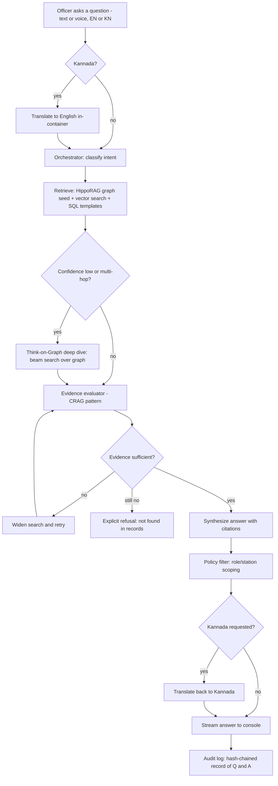
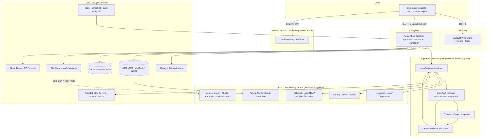

# Veritas — Briefing Document for the Slide Deck

**Purpose of this document**: you're building the slide deck and don't have context on the
project. Read this top to bottom and you'll have everything needed for all 13 sections asked
for. Each section below maps 1:1 to a slide (or slide group). Where a claim is a number, it's
a real, currently-true number pulled from the codebase and live deployment — not a guess — so
you can quote it directly.

If you want to go deeper than this doc on any point, the source of truth is
`CLAUDE.md` at the repo root (~2000 lines, the full architecture rationale) and
`docs/WORK_LOG.md` (pass-by-pass build history). This doc is a distillation of both, aimed at
someone building slides, not code.

---

## 1. Brief about the solution

**Veritas** is a conversational crime-intelligence platform built for the **Karnataka State
Police (KSP)**, for **Datathon 2026, Challenge 01**.

An officer asks a question in plain English or Kannada — typed or spoken — and gets an answer
where **every claim traces back to a specific record**. Not a chatbot bolted onto a database:
a multi-agent reasoning system that retrieves across a knowledge graph, a vector index and the
relational crime records, cites its sources, verifies its own evidence before answering, and
explicitly refuses rather than guesses when the records don't support an answer.

It runs entirely on **Zoho Catalyst** (the competition's mandated cloud platform), built on a
police FIR/crime dataset schema the organizers provided (`Police_FIR_ER_Diagram.pdf`).

The one-line pitch: *"Ask a question about a case, a person, or a crime pattern — in English
or Kannada — and get a cited, verifiable answer instead of a search result."*

---

## 2. Opportunities

### 2.1 How is this different from other existing ideas?

Most "crime data dashboard" or "chatbot over police data" projects at a hackathon do one of
two things: (a) a BI dashboard with filters and charts, or (b) an LLM wired directly to a SQL
database that writes its own queries against real evidence data.

Veritas deliberately avoids both:

- **No LLM writes queries against evidence.** There is no text-to-SQL or text-to-Cypher
  fallback anywhere in the system. An LLM hallucinating a WHERE clause against a crime record
  store is exactly the failure mode a law-enforcement tool cannot afford. Retrieval is done by
  deterministic graph algorithms (personalized PageRank, beam search) and templated queries;
  the LLM only makes the final answer *readable*, never *true*.
- **It solves a real data problem the organizers' schema has, not a fake one.** The provided
  ER schema has an `Accused` table, but no concept of a *person* — each row belongs to exactly
  one case, with a per-case label ("A1", "A2"). Nothing says the "Ramesh Gowda" on one FIR and
  the "Ramesha Gouda" on another are the same man. So on the raw schema: nobody has priors,
  nobody has co-offenders, there's no criminal network, and a "show me this person's full
  record" feature is structurally impossible. Veritas runs **probabilistic record linkage**
  (Fellegi-Sunter, a 1969 statistical method) as a first-class pipeline stage to *reconstruct*
  people from accused rows — measured at **F1 0.989** (precision 0.997, recall 0.981) against
  a generated answer key. This is the single hardest, most load-bearing piece of engineering
  in the project, and it's what everything else (network graph, financial-crime tracing,
  recidivism risk, "does this person have priors") depends on.
- **Every answer is falsifiable, not just plausible.** Any result on screen can be clicked and
  asked "why is this here?" and the system answers with the actual records and reasoning chain
  — not a restatement of which AI component ran. A wrong-looking answer can be checked in
  seconds instead of trusted blindly.

### 2.2 How does it solve the problem?

The problem, as posed by the challenge, is: police data across FIRs is siloed, hard to query,
and impossible for an investigating officer to reason over quickly — connections between
cases, people, and money require manual cross-referencing across dozens of paper/digital
records. Veritas solves this by:

1. **Reconstructing identity** so cases stop being isolated rows and start being a connected
   record of who did what, with whom, how often.
2. **Building a real knowledge graph** (co-accused networks, financial transfers, case-location
   links) that supports multi-hop reasoning ("who has this person worked with before, and on
   what money trail?") — the exact kind of question a manual FIR search cannot answer.
3. **Answering in natural language, in English or Kannada**, so the tool works for an officer
   typing at a desk or speaking in the field, without needing to know a query language.
4. **Never fabricating an answer.** A built-in evidence evaluator (CRAG-pattern) checks
   retrieval quality before synthesis and explicitly says "not found in the records" rather
   than inventing a plausible-sounding answer — critical for a domain where a wrong claim has
   real consequences.
5. **Giving investigators decision support, not automation.** Risk scores, forecasts and
   hotspot predictions are all explicitly labeled as model output (never presented as fact),
   and nothing in the system auto-triggers an action — every prediction stays human-in-the-loop.

### 2.3 USP of the proposed solution

- **Identity resolution as the centerpiece, not an add-on** — the one piece of engineering that
  turns a flat crime-record schema into an actual investigative graph. F1 0.989.
- **Full provenance on every claim** — a "why is this here?" button on any result (an
  associate, a hotspot, a timeline event, a financial transfer) that returns the actual
  supporting records and derivation chain, not a description of the pipeline.
- **Bilingual, voice-capable, end-to-end in-container** — Kannada ASR/TTS/translation runs
  entirely inside the app's own container (faster-whisper + NLLB), so no data ever leaves the
  deployment to a third-party speech API.
- **Answers are typed by evidence kind, visually** — a record fact (■), a derived inference
  (◆), and a model estimate (▲) are three different, unmistakable visual channels everywhere
  in the console. A model's guess can never be mistaken for a stated fact.
- **Responsible-AI-audited by design** — no protected attributes (caste, religion) reach any
  model; a fairness audit (Aequitas, the same toolkit publicly used to evaluate COMPAS) runs
  across demographic *and geographic* subgroups, because geography is the axis that catches
  the over-policing feedback loop a naive audit misses.
- **Built entirely on the mandated platform** — every core capability runs on a real Zoho
  Catalyst service; the handful of exceptions (Kannada speech, map tiles, the graph engine)
  are things Catalyst's catalog genuinely has no equivalent for, and each is named and
  justified rather than quietly worked around.

---

## 3. List of features

**Conversational intelligence (Copilot)**
- Natural-language Q&A over the full crime dataset, English and Kannada, typed or voice
- Multi-turn conversation with memory (pronoun resolution — "does *he* have priors?")
- Streaming answers with a live reasoning-trace panel (plain-language, expandable to detail)
- Explicit refusal when evidence doesn't support an answer (never fabricates)

**Investigation tools**
- Case Overview: narrative, facts, people (with identity cross-references), open questions
- Investigation Copilot: chronological case timeline, top-5 similar past cases, ranked
  investigative leads, paste-ready case-diary paragraph
- Investigation Board: a persistent, per-case artifact — pinned evidence, notes, leads
  (open/pursued/dismissed), that survives across sessions and officers
- "Why is this here?" — click any result to see the records and reasoning behind it
- Person record view: full cross-case history, priors, co-offender network — impossible on
  the raw schema, only possible because of identity resolution

**Analytics & visualization**
- Interactive map (real MapLibre basemap) with FIR points and KDE/DBSCAN crime hotspots
- Co-offending network graph (PageRank, Louvain community detection, betweenness centrality)
- Financial crime tracing — account/transaction graph with a Sankey money-flow view
- Crime forecasting (Prophet + hierarchical reconciliation) with confidence intervals
- Recidivism risk scoring (XGBoost + SHAP explanations) and district anomaly alerts
- AI-driven suspicious transaction detection (rule-based structuring detector + a GNN for
  coordinated multi-account laundering patterns)

**Search & access**
- Unified ⌘K search across cases, people, sections, stations — ranked, with match reasons
- Role-based access control (rank/station-scoped) enforced at both the API and the
  query-construction layer
- Tamper-evident audit log (SHA-256 hash chain) of every query and answer, auto-verified
  every 12 hours
- PDF export of any finding

---

## 4. Process flow / Use case diagram

**Use case diagram (actors and what they can do):**

```mermaid
graph LR
  IO[Investigating Officer]
  SHO[Station House Officer]
  DSP[DSP / SP]
  ANALYST[SCRB Analyst]
  IG[IG - state-wide]

  IO --> UC1[Ask about own station's cases]
  IO --> UC2[Check a person's priors]
  IO --> UC3[Get investigative leads]
  SHO --> UC1
  SHO --> UC4[View station-wide case board]
  DSP --> UC5[Cross-station case search]
  DSP --> UC6[View network / financial trace]
  ANALYST --> UC7[Run hotspot / forecast analytics]
  ANALYST --> UC8[Audit fairness metrics]
  IG --> UC9[State-wide statistics and trends]
  IG --> UC5
  IO --> UC10[Ask "why is this here?"]
  DSP --> UC10
```

**Process flow (a single question, end to end):**



---

## 5. Wireframes / mock diagrams of the proposed solution

The prototype is **built and live**, so use real screenshots rather than hand-drawn wireframes
— they're stronger evidence for a judge anyway. All screenshots are in
`docs/screenshots/2026-08-29-workstation-redesign/` (latest full UI pass) and
`docs/screenshots/2026-08-30-voice-and-search/` (voice + search, most recent). Recommended set
for slides:

| File | What it shows |
|---|---|
| `01-register.png` | Case register / home — the officer's entry point |
| `02-case-finding.png` | Opening a case, chat panel in action |
| `03-evidence-inspector.png` | Clicking a citation — full record, provenance, confidence |
| `04-evidence-thread.png` | The visual line drawn from a claim to its source record |
| `05-network.png` | Co-offender network graph |
| `06-geography.png` | Hotspot map (real basemap, density overlay) |
| `07-forecast.png` | Crime trend forecast with confidence bands |
| `09-timeline.png` | Case timeline view |
| `10-board.png` | Investigation Board (persistent case artifact) |
| `13-financial.png` | Financial crime / money-trail Sankey view |
| `14-briefing.png` | Copilot investigation briefing overlay |
| `18-alerts.png` | Live anomaly alerts |
| `20-kannada.png` | Kannada Q&A round-trip |
| `02-recording.png` (voice-and-search folder) | Push-to-talk voice input |
| `04-search-multiword.png` (voice-and-search folder) | ⌘K search results |

Layout, for a slide describing the design language (useful context if recreating a mock):
a top bar, a persistent investigation header with workspace tabs, and three columns —
**left**: conversational copilot; **center**: workspace (Overview/Timeline/Network/
Geography/Financial/Board tabs); **right**: evidence rail. Light theme by default (warm
off-white, institutional-record aesthetic), dark theme available as a toggle.

---

## 6. Architecture diagram — specific to each service used



**Why each service is where it is** (for the slide's callouts):

| Layer | Catalyst service | Replaces | Why |
|---|---|---|---|
| API runtime | **AppSail** (custom container) | self-hosted server | FastAPI runs as-is on Catalyst compute |
| Console hosting | **Web Client Hosting (Slate)** | static host | Next.js static export |
| Identity | **Catalyst Authentication** | custom JWT auth | Catalyst confirms *who*; app data confirms *role/station* |
| Database | **Data Store (ZCQL)** | PostgreSQL | 37 tables — 27 organizer schema, 10 our own |
| Model weights | **File Store** | filesystem | ~760MB, streamed at cold start, keeps container image small |
| Session cache | **Cache** | none | Session focus, read every turn |
| LLM | **QuickML LLM Serving** (GLM-4.7-Flash) | Gemini/OpenAI | No API key baked into the image |
| Scheduling | **Cron** | none | Data refresh (6h), audit chain verification (12h) |
| PDF export | **SmartBrowz** | headless Chrome | Server-side rendering |

**The five documented exceptions** (things kept off-Catalyst, each because no Catalyst
service exists for it — the competition rule explicitly permits this):

| Capability | Kept on | Why |
|---|---|---|
| Kannada ASR/TTS/translation | faster-whisper + NLLB, in-container | Catalyst has no speech or translation service |
| Vector search | numpy over a cached blob | No arbitrary-embedding store in QuickML |
| Knowledge graph | NetworkX over a Data Store edge table | No Catalyst service is a graph database |
| Audit immutability | SHA-256 hash chain in the data itself | Data Store has no rules/triggers to enforce it at the DB level |
| Map tiles | OpenFreeMap (open, no API key) | No Catalyst service provides map tiles |

---

## 7. Technologies used

**Backend / API**: Python, FastAPI, LangGraph (multi-agent orchestration), Uvicorn

**AI / ML**:
- Fellegi-Sunter probabilistic record linkage (identity resolution)
- HippoRAG (Personalized PageRank retrieval) + Think-on-Graph (beam search reasoning)
- CRAG-style evidence evaluator
- XGBoost, LightGBM (risk scoring, recidivism prediction)
- Prophet + MinT hierarchical reconciliation (crime forecasting)
- DoWhy (causal inference layer)
- Isolation Forest (anomaly/spike detection)
- Graph Neural Network + rule-based detector (money-laundering pattern detection)
- Aequitas (fairness/bias auditing)
- KDE + DBSCAN (crime hotspot clustering)
- faster-whisper (speech-to-text), NLLB-200 (translation), for Kannada

**Graph & data processing**: NetworkX (graph algorithms), numpy (vector search), pandas

**Frontend**: Next.js (static export), TypeScript, MapLibre GL (mapping), custom
visualization components (network graph, Sankey, charts)

**Data**: Faker-based synthetic data generator seeded with real NCRB Karnataka crime
statistics, real Census 2011 district socioeconomics, real KA-GIS geographic boundaries

**Infrastructure**: Zoho Catalyst (full platform — see §6/§8), Docker (container build),
GitHub Actions (CI/deploy relay)

---

## 8. Zoho Catalyst services used

1. **AppSail** — hosts the FastAPI backend (custom OCI runtime container)
2. **Web Client Hosting (Slate)** — hosts the Next.js console
3. **Catalyst Authentication** — officer identity/sign-in
4. **Data Store** — the relational database (37 tables, ZCQL query language)
5. **File Store** — object storage for ML model weights
6. **Cache** — session state (per-turn conversation focus)
7. **QuickML LLM Serving** — hosted LLM inference (GLM-4.7-Flash) for answer synthesis
8. **Cron** — scheduled jobs (6-hourly data refresh, 12-hourly audit-chain verification)
9. **SmartBrowz** — headless-browser PDF rendering for report export

(Plus the five explicitly-justified exceptions in §6/§2 where no Catalyst service exists
for the capability — this is worth its own slide, since a judge will ask "why isn't X on
Catalyst" and having the answer ready per-item is stronger than a blanket disclaimer.)

---

## 9. Estimated implementation cost

Two honest numbers, not one — say both on the slide:

**As currently built and running (datathon prototype)**: effectively **₹0/month**, run
entirely within Zoho Catalyst's free/development-tier credits. The team deliberately
optimized for this — see engineering note below — AppSail kept at the lowest viable memory
(2048MB), no polling, batched database reads, LLM calls only made per actual user query (the
deterministic reasoning paths answer without one), model weights fetched once and cached
rather than re-downloaded.

**Estimated cost at real-world production scale** (illustrative, for a slide framing "what
would this cost KSP to run for real" — base this on Catalyst's published consumption-based
pricing at deploy time, since pricing tiers change):

| Component | Driver | Notes |
|---|---|---|
| AppSail compute | requests/hour, memory-hours | Scales with concurrent officer sessions |
| Data Store | rows stored + queries/month | 37 tables; current dataset ~10,000 FIRs, ~127k rows total |
| File Store | GB stored | ~760MB of model weights, fixed regardless of usage |
| QuickML LLM calls | tokens/request | Only Kannada/free-text answers invoke it; templated answers don't |
| Cache | reads/month | One read per conversation turn |
| Cron | fixed | Two scheduled jobs, negligible |
| SmartBrowz | PDF renders/month | Only on explicit export |

The honest framing for the slide: **cost scales with adoption, not with data volume** — the
architecture was built cost-conscious from day one (deterministic paths avoid unnecessary LLM
calls, in-container ML avoids per-call external API billing), so a state-wide rollout's
marginal cost per officer session stays low relative to a design that called an external LLM
API for every single query.

---

## 10. Snapshots of the prototype (latest version)

Use screenshots from `docs/screenshots/2026-08-30-voice-and-search/` (most recent capture,
2026-08-30) alongside `docs/screenshots/2026-08-29-workstation-redesign/` (fullest UI
coverage) — see the table in §5 for which files show which screen. These were captured by
driving the actual live/local console with a real browser, not mocked.

Live, currently-deployed URLs (usable directly in the deck as "try it live"):
- **Console**: `https://veritas-60077763394.development.catalystserverless.in/app/index.html`
- **API**: `https://veritas-api-50043864344.development.catalystappsail.in`

---

## 11. Prototype performance report / benchmarking

**Identity resolution (the core ML claim)**:
- **F1 0.989** (precision 0.997, recall 0.981) against a generated ground-truth answer key
- This is the number that matters most on a benchmarking slide — it's the metric that proves
  the "reconstruct people from case records" claim actually works, not just runs.

**Scale of the live dataset**:
- 10,000 synthetic FIRs (crime records)
- Knowledge graph: 16,918 nodes / 87,120 edges
- Vector index: 13,835 indexed documents
- 37 database tables, ~127,000+ total rows across the schema

**Test coverage / correctness**:
- **741 automated tests passing** (2 skipped), zero database/Docker dependency required to run
  them — run with `python -m pytest`
- Two independent live-behavior gates run against the deployed production system:
  - `judge_flows.py`: **26/26** realistic officer conversation sessions passing
  - `verify_live_deployment.py`: **36/36** adversarial conversational scenarios passing
- A 1,701-question test corpus (`tests/officer_inputs.py` + `tests/judge_inputs.py`) generated
  from the dataset's own real districts/offences/sections, covering both realistic officer
  phrasing and adversarial "how do you know this / could this be wrong" judge questions —
  currently 100% correctly routed

**System responsiveness** (measured, in-container):
- Warm Kannada translation round-trip: ~4.3 seconds (down from 13.4s after a warm-up fix)
- Cold container model-weight load: ~20 seconds one-time cost per new container start (mitigated
  by pre-warming on startup rather than on the first user's request)
- API health check confirms live status: LLM connected, Data Store connected, graph and vector
  index loaded, cache connected

**Responsible AI**: fairness/bias metrics computed via Aequitas across demographic *and*
geographic subgroups (disparate impact, false-positive/false-negative rate parity) — run
out-of-band as an auditable check, not gating production answers.

---

## 12. Links

- **GitHub repository**: https://github.com/baveshraam/Veritas
- **Deployed console (live)**: https://veritas-60077763394.development.catalystserverless.in/app/index.html
- **Deployed API (live)**: https://veritas-api-50043864344.development.catalystappsail.in
  (try `/health` for a live status readout)
- **Catalyst project**: `Veritas` (project id `52852000000013048`, org `60077763394`)

---

## 13. Additional details / future development

**What's deliberately NOT built** (worth a slide — shows scoping discipline, not gaps):
Kafka/Flink for real-time CCTNS ingestion, Iceberg/MinIO for large-scale storage,
Keycloak/OPA for enterprise identity/policy, Kubernetes/GitOps, MLflow — all described as a
production scaling path rather than built, because the current data volume and single-deploy
scope don't yet justify them.

**Two things checked and correctly declined**, worth mentioning as evidence of engineering
judgment rather than corner-cutting:
- `dowhy`'s full causal-inference package was sized against the deployment's hard container
  size limit and found to leave effectively no safety margin — kept out rather than risking a
  broken deploy for a nice-to-have.
- PDF export via the platform's native headless-browser service hit a genuine platform
  identity-scoping limitation; the console still exports a fallback document and states clearly
  that it did so, rather than silently failing.

**Future development directions**:
- Real-time ingestion from an actual CCTNS-style crime data feed (currently trained/demoed on
  realistic synthetic data seeded with real NCRB/Census/GIS ground truth, since no real FIR
  data was available for the competition)
- Expanding the causal-inference layer once real historical volume justifies the compute cost
- A dedicated in-visualization "pin to investigation board" click target on every chart type
  (currently available generically, a per-chart shortcut is a small additive follow-up)
- Cross-entity timeline correlation view (currently timelines are per-case; a cross-case
  correlated view was scoped but deprioritized behind higher-value features)
- Full production-grade policy engine (OPA/Rego) once the RBAC rule set outgrows a
  straightforward Python module — noted as a scaling path, not a current gap

**Responsible-AI posture worth a dedicated slide**: predictive policing tools have a
documented history of laundering historical over-policing bias into "objective" risk scores.
Veritas addresses this directly — no protected/proxy attributes are ever fed to a model,
fairness auditing runs across geographic as well as demographic lines, every prediction is
explicitly decision-support (never an automated trigger), and the causal-inference layer names
its own unmeasured confounder (police strength isn't publicly published per district in India)
rather than silently ignoring it.
