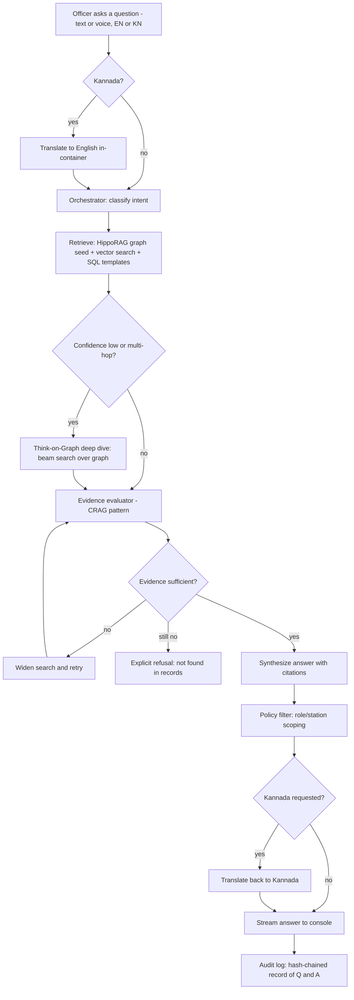
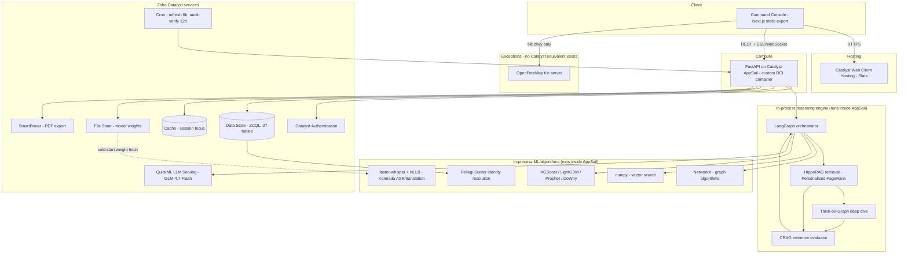

# Veritas — Briefing Document for the Slide Deck

**Purpose**: everything needed for all 13 required slide sections, distilled from `CLAUDE.md`
and `docs/WORK_LOG.md` for someone building slides, not code. Each section maps 1:1 to a
slide/slide group. Numbers quoted here are real, pulled from the codebase and live
deployment — quotable directly.

---

## 1. Brief about the solution

**Veritas** is a conversational crime-intelligence platform built for the **Karnataka State
Police (KSP)**, for **Datathon 2026, Challenge 01**.

An officer asks a question in plain English or Kannada — typed or spoken — and gets an answer
where **every claim traces back to a specific record**. Not a chatbot bolted onto a database: a
multi-agent reasoning system that retrieves across a knowledge graph, a vector index and the
relational crime records, cites its sources, verifies its own evidence before answering, and
explicitly refuses rather than guesses when the records don't support an answer.

Runs entirely on **Zoho Catalyst** (the competition's mandated platform), on a police FIR/crime
dataset schema the organizers provided (`Police_FIR_ER_Diagram.pdf`).

One-line pitch: *"Ask a question about a case, a person, or a crime pattern — in English or
Kannada — and get a cited, verifiable answer instead of a search result."*

---

## 2. Opportunities

### 2.1 How is this different from other existing ideas?

Most "crime data dashboard" or "chatbot over police data" hackathon projects do one of two
things: (a) a BI dashboard with filters and charts, or (b) an LLM wired directly to write its
own SQL/Cypher against real evidence data. Veritas avoids both:

- **No LLM writes queries against evidence** — no text-to-SQL or text-to-Cypher fallback
  anywhere. Retrieval is deterministic (personalized PageRank, beam search, templated queries);
  the LLM only makes the final answer *readable*, never *true*.
- **It solves a real data problem the organizers' schema has.** The ER's `Accused` table has no
  concept of a *person* — each row belongs to exactly one case, with a per-case label ("A1",
  "A2"). Nothing says the "Ramesh Gowda" on one FIR and "Ramesha Gouda" on another are the same
  man. So on the raw schema: nobody has priors, nobody has co-offenders, there's no criminal
  network, and "show me this person's full record" is structurally impossible. Veritas runs
  **probabilistic record linkage** (Fellegi-Sunter, 1969) to *reconstruct* people from accused
  rows — **F1 0.989** (precision 0.997, recall 0.981) against a generated answer key. This is
  the single hardest, most load-bearing piece of engineering in the project — the network graph,
  financial tracing, recidivism risk and "does this person have priors" all depend on it.
- **Every answer is falsifiable, not just plausible.** Any result can be clicked and asked "why
  is this here?" and the system answers with the actual records and reasoning chain, not a
  restatement of which component ran — checkable in seconds instead of trusted blindly.

### 2.2 How does it solve the problem?

The challenge's problem: police data across FIRs is siloed and hard to reason over — connections
between cases, people, and money require manual cross-referencing. Veritas solves this by
reconstructing identity (§2.1) so cases become a connected record instead of isolated rows;
building a real knowledge graph (co-accused networks, financial transfers, case-location links)
for multi-hop reasoning a manual FIR search can't do; answering in English or Kannada so the
tool works at a desk or in the field without a query language; never fabricating (a CRAG-pattern
evidence evaluator says "not found in the records" rather than inventing an answer); and staying
decision-support, not automation — risk scores/forecasts/hotspots are always labeled as model
output, and nothing auto-triggers an action.

### 2.3 USP of the proposed solution

- **Identity resolution as the centerpiece, not an add-on** — F1 0.989, the one piece of
  engineering that turns a flat crime-record schema into an actual investigative graph.
- **Full provenance on every claim** — "why is this here?" on any result returns the actual
  supporting records and derivation chain, not a pipeline description.
- **Bilingual, voice-capable, end-to-end in-container** — Kannada ASR/TTS/translation
  (faster-whisper + NLLB) runs entirely inside the app's own container; no data leaves the
  deployment to a third-party speech API.
- **Answers typed by evidence kind, visually** — a record fact (■), a derived inference (◆), and
  a model estimate (▲) are three unmistakable visual channels everywhere in the console.
- **Responsible-AI-audited by design** — no protected attributes (caste, religion) reach any
  model; Aequitas (the toolkit publicly used to evaluate COMPAS) audits across demographic *and
  geographic* subgroups, since geography is the axis that catches the over-policing feedback
  loop a naive audit misses.
- **Built entirely on the mandated platform** — every core capability runs on a real Catalyst
  service; the handful of exceptions (Kannada speech, map tiles, the graph engine) are things
  Catalyst's catalog genuinely has no equivalent for, each named and justified.

---

## 3. List of features

**Conversational intelligence (Copilot)**
- Natural-language Q&A over the full crime dataset, English and Kannada, typed or voice
- Multi-turn conversation with memory (pronoun resolution — "does *he* have priors?")
- Streaming answers with a live reasoning-trace panel (plain-language, expandable to detail)
- Explicit refusal when evidence doesn't support an answer

**Investigation tools**
- Case Overview: narrative, facts, people (with identity cross-references), open questions
- Investigation Copilot: chronological timeline, top-5 similar past cases, ranked leads,
  paste-ready case-diary paragraph
- Investigation Board: a persistent, per-case artifact — pinned evidence, notes, leads
  (open/pursued/dismissed) — surviving across sessions and officers
- "Why is this here?" — click any result to see the records and reasoning behind it
- Person record view: full cross-case history, priors, co-offender network — only possible
  because of identity resolution

**Analytics & visualization**
- Interactive map (real MapLibre basemap) with FIR points and KDE/DBSCAN crime hotspots
- Co-offending network graph (PageRank, Louvain, betweenness centrality)
- Financial crime tracing — account/transaction graph with a Sankey money-flow view
- Crime forecasting (Prophet + hierarchical reconciliation) with confidence intervals
- Recidivism risk scoring (XGBoost + SHAP) and district anomaly alerts
- AI-driven suspicious transaction detection (rule-based structuring detector + a GNN for
  coordinated multi-account laundering)

**Search & access**
- Unified ⌘K search across cases, people, sections, stations — ranked, with match reasons
- Role-based access control (rank/station-scoped), enforced at both API and query-construction
- Tamper-evident audit log (SHA-256 hash chain), auto-verified every 12 hours
- PDF export of any finding

---

## 4. Process flow / Use case diagram

**Use case diagram:**

```mermaid
graph LR
  IO[Investigating Officer]
  SHO[Station House Officer]
  DSP[DSP / SP]
  ANALYST[SCRB Analyst]
  IG[IG - state-wide]

  IO --> UC1[Ask about own station's cases]
  IO --> UC2[Check a person's priors]
  IO --> UC3[Get investigative leads]
  SHO --> UC1
  SHO --> UC4[View station-wide case board]
  DSP --> UC5[Cross-station case search]
  DSP --> UC6[View network / financial trace]
  ANALYST --> UC7[Run hotspot / forecast analytics]
  ANALYST --> UC8[Audit fairness metrics]
  IG --> UC9[State-wide statistics and trends]
  IG --> UC5
  IO --> UC10[Ask "why is this here?"]
  DSP --> UC10
```

**Process flow (a single question, end to end):**



---

## 5. Wireframes / mock diagrams of the proposed solution

The prototype is **built and live** — use real screenshots, stronger than hand-drawn wireframes.
All in `docs/screenshots/2026-08-29-workstation-redesign/` (latest full UI pass) and
`docs/screenshots/2026-08-30-voice-and-search/` (most recent):

| File | What it shows |
|---|---|
| `01-register.png` | Case register / home — the officer's entry point |
| `02-case-finding.png` | Opening a case, chat panel in action |
| `03-evidence-inspector.png` | Clicking a citation — full record, provenance, confidence |
| `04-evidence-thread.png` | The visual line drawn from a claim to its source record |
| `05-network.png` | Co-offender network graph |
| `06-geography.png` | Hotspot map (real basemap, density overlay) |
| `07-forecast.png` | Crime trend forecast with confidence bands |
| `09-timeline.png` | Case timeline view |
| `10-board.png` | Investigation Board (persistent case artifact) |
| `13-financial.png` | Financial crime / money-trail Sankey view |
| `14-briefing.png` | Copilot investigation briefing overlay |
| `18-alerts.png` | Live anomaly alerts |
| `20-kannada.png` | Kannada Q&A round-trip |
| `02-recording.png` (voice-and-search) | Push-to-talk voice input |
| `04-search-multiword.png` (voice-and-search) | ⌘K search results |

Design language: a top bar, a persistent investigation header with workspace tabs, three
columns — **left** conversational copilot, **center** workspace (Overview/Timeline/Network/
Geography/Financial/Board), **right** evidence rail. Light theme by default (warm off-white,
institutional-record aesthetic), dark theme available as a toggle.

---

## 6. Architecture diagram — specific to each service used



**Why each service is where it is:**

| Layer | Catalyst service | Replaces | Why |
|---|---|---|---|
| API runtime | **AppSail** (custom container) | self-hosted server | FastAPI runs as-is on Catalyst compute |
| Console hosting | **Web Client Hosting (Slate)** | static host | Next.js static export |
| Identity | **Catalyst Authentication** | custom JWT auth | Catalyst confirms *who*; app data confirms *role/station* |
| Database | **Data Store (ZCQL)** | PostgreSQL | 37 tables — 27 organizer schema, 10 our own |
| Model weights | **File Store** | filesystem | ~760MB, streamed at cold start, keeps image small |
| Session cache | **Cache** | none | Session focus, read every turn |
| LLM | **QuickML LLM Serving** (GLM-4.7-Flash) | Gemini/OpenAI | No API key baked into the image |
| Scheduling | **Cron** | none | Data refresh (6h), audit chain verification (12h) |
| PDF export | **SmartBrowz** | headless Chrome | Server-side rendering |

**The five documented exceptions** (no Catalyst service exists for these — explicitly permitted
by the competition rule):

| Capability | Kept on | Why |
|---|---|---|
| Kannada ASR/TTS/translation | faster-whisper + NLLB, in-container | Catalyst has no speech or translation service |
| Vector search | numpy over a cached blob | No arbitrary-embedding store in QuickML |
| Knowledge graph | NetworkX over a Data Store edge table | No Catalyst service is a graph database |
| Audit immutability | SHA-256 hash chain in the data itself | Data Store has no rules/triggers to enforce it at DB level |
| Map tiles | OpenFreeMap (open, no API key) | No Catalyst service provides map tiles |

---

## 7. Technologies used

**Backend / API**: Python, FastAPI, LangGraph (multi-agent orchestration), Uvicorn

**AI / ML**: Fellegi-Sunter (identity resolution) · HippoRAG (Personalized PageRank retrieval) +
Think-on-Graph (beam search) · CRAG-style evidence evaluator · XGBoost, LightGBM (risk scoring,
recidivism) · Prophet + MinT reconciliation (forecasting) · DoWhy (causal inference) ·
Isolation Forest (anomaly detection) · GNN + rule-based detector (money-laundering patterns) ·
Aequitas (fairness/bias auditing) · KDE + DBSCAN (hotspot clustering) · faster-whisper
(speech-to-text), NLLB-200 (translation), for Kannada

**Graph & data processing**: NetworkX, numpy (vector search), pandas

**Frontend**: Next.js (static export), TypeScript, MapLibre GL, custom visualization
components (network graph, Sankey, charts)

**Data**: Faker-based synthetic generator seeded with real NCRB Karnataka crime statistics,
real Census 2011 district socioeconomics, real KA-GIS geographic boundaries

**Infrastructure**: Zoho Catalyst (full platform — §6/§8), Docker (container build), GitHub
Actions (CI/deploy relay)

---

## 8. Zoho Catalyst services used

**AppSail** (FastAPI backend, custom OCI container) · **Web Client Hosting/Slate** (console) ·
**Catalyst Authentication** (officer sign-in) · **Data Store** (37 tables, ZCQL) · **File
Store** (ML model weights) · **Cache** (per-turn session state) · **QuickML LLM Serving**
(GLM-4.7-Flash, answer synthesis) · **Cron** (6h refresh, 12h audit-chain verification) ·
**SmartBrowz** (headless-browser PDF export).

The five explicitly-justified exceptions are in §6/§2 — keep the per-item answer ready for
"why isn't X on Catalyst."

---

## 9. Estimated implementation cost

Two numbers, both worth stating:

**As currently built and running**: effectively **₹0/month**, within Zoho Catalyst's
free/development-tier credits. Deliberately optimized for this: AppSail kept at the lowest
viable memory (2048MB), no polling, batched database reads, LLM calls made only per actual
free-text query (deterministic paths answer without one), model weights fetched once and cached.

**Estimated cost at real-world production scale** (illustrative, base on Catalyst's published
consumption pricing at deploy time):

| Component | Driver | Notes |
|---|---|---|
| AppSail compute | requests/hour, memory-hours | Scales with concurrent officer sessions |
| Data Store | rows stored + queries/month | 37 tables; ~10,000 FIRs, ~127k rows total |
| File Store | GB stored | ~760MB weights, fixed regardless of usage |
| QuickML LLM calls | tokens/request | Only Kannada/free-text answers invoke it |
| Cache | reads/month | One read per conversation turn |
| Cron | fixed | Two scheduled jobs, negligible |
| SmartBrowz | PDF renders/month | Only on explicit export |

Framing: **cost scales with adoption, not data volume** — deterministic paths avoid unnecessary
LLM calls, in-container ML avoids per-call external API billing, so a state-wide rollout's
marginal cost per officer session stays low relative to a design that called an external LLM
API for every query.

---

## 10. Snapshots of the prototype (latest version)

Screenshots: see §5 (both folders) — captured by driving the live/local console with a real
browser, not mocked.

Live URLs (usable directly as "try it live"):
- **Console**: `https://veritas-60077763394.development.catalystserverless.in/app/index.html`
- **API**: `https://veritas-api-50043864344.development.catalystappsail.in`

---

## 11. Prototype performance report / benchmarking

**Identity resolution (the core ML claim)**: **F1 0.989** (precision 0.997, recall 0.981)
against a generated ground-truth answer key — the metric that proves the "reconstruct people
from case records" claim actually works, not just runs.

**Scale of the live dataset**: 10,000 synthetic FIRs · knowledge graph 16,918 nodes / 87,120
edges · vector index 13,835 indexed documents · 37 database tables, ~127,000+ total rows.

**Test coverage / correctness**: **868 automated tests passing** (2 skipped), zero
database/Docker dependency to run them (`python -m pytest`). Two independent live-behavior
gates run against the deployed system: `judge_flows.py` 26/26 realistic officer sessions,
`verify_live_deployment.py` 36/36 adversarial scenarios. A 1,701-question corpus
(`tests/officer_inputs.py` + `tests/judge_inputs.py`), generated from the dataset's own
real districts/offences/sections, covers realistic officer phrasing and adversarial "how do
you know this / could this be wrong" judge questions — 100% correctly routed.

**System responsiveness** (measured, in-container): warm Kannada translation round-trip ~4.3s
(down from 13.4s after a warm-up fix); cold container model-weight load ~20s one-time per new
container start (mitigated by pre-warming on startup, not on the first user's request); `/health`
confirms LLM/Data Store/graph/vector-index/cache all connected.

**Responsible AI**: fairness/bias metrics via Aequitas across demographic *and* geographic
subgroups (disparate impact, FPR/FNR parity) — run out-of-band as an auditable check, not
gating production answers.

---

## 12. Links

- **GitHub repository**: https://github.com/baveshraam/Veritas
- **Deployed console (live)**: https://veritas-60077763394.development.catalystserverless.in/app/index.html
- **Deployed API (live)**: https://veritas-api-50043864344.development.catalystappsail.in
  (try `/health` for a live status readout)
- **Catalyst project**: `Veritas` (project id `52852000000013048`, org `60077763394`)

---

## 13. Additional details / future development

**What's deliberately NOT built** (shows scoping discipline, not gaps): Kafka/Flink for
real-time CCTNS ingestion, Iceberg/MinIO for large-scale storage, Keycloak/OPA for enterprise
identity/policy, Kubernetes/GitOps, MLflow — described as a production scaling path, not built,
because current data volume and single-deploy scope don't yet justify them.

**Two things checked and correctly declined** (engineering judgment, not corner-cutting):
`dowhy`'s full causal-inference package was sized against the deployment's hard container-size
limit and found to leave no safety margin — kept out. PDF export via the platform's native
headless-browser service hit a genuine platform identity-scoping limitation; the console still
exports a fallback document and states clearly that it did so.

**Future development directions**: real-time ingestion from an actual CCTNS-style feed
(currently realistic synthetic data seeded with real NCRB/Census/GIS ground truth, since no real
FIR data was available); expanding the causal-inference layer once real historical volume
justifies the compute cost; full production-grade policy engine (OPA/Rego) once the RBAC rule
set outgrows a Python module.

**Responsible-AI posture** (worth a dedicated slide): predictive policing tools have a
documented history of laundering historical over-policing bias into "objective" risk scores.
Veritas addresses this directly — no protected/proxy attributes ever reach a model, fairness
auditing runs across geographic as well as demographic lines, every prediction is explicitly
decision-support (never an automated trigger), and the causal-inference layer names its own
unmeasured confounder (police strength isn't publicly published per district in India) rather
than silently ignoring it.
